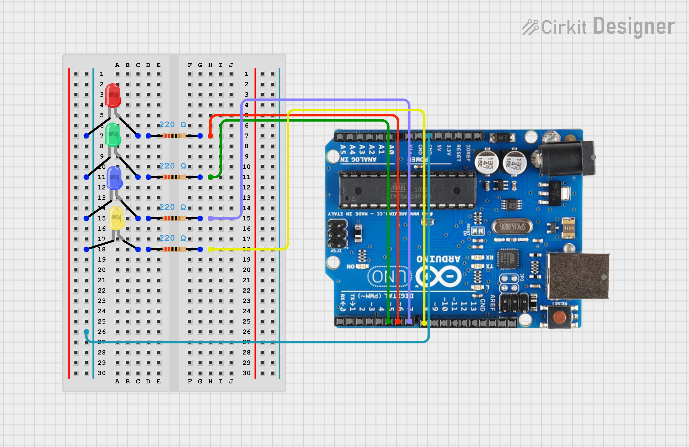

# Voice-Controlled LED System with Arduino and Python

This project enables voice control of LEDs connected to an Arduino board using Python's `speech_recognition`, `pyttsx3`, and `PyFirmata2` libraries. Users can turn specific LEDs on or off using voice commands.

## Prerequisites

* **Python 3.x:** Installed.
* **speech_recognition:** Install using `pip install SpeechRecognition`.
* **pyttsx3:** Install using `pip install pyttsx3`.
* **PyFirmata2:** Install using `pip install pyfirmata2`.
* **Arduino IDE:** Installed and configured.
* **Arduino Board (e.g., Arduino Uno):** Connected to your computer.
* **LEDs (Red, Green, Blue, Yellow):** Connected to the Arduino.
* **220 Ohm Resistors (4):** For current limiting with the LEDs.
* **Microphone:** Connected to your computer.
* **Internet Connection:** Required for voice recognition.

## Hardware Setup

1.  **LED Connections:**
    * Connect the anode (longer leg) of the **red LED** to digital pin **6** of the Arduino.
    * Connect the anode of the **green LED** to digital pin **5** of the Arduino.
    * Connect the anode of the **blue LED** to digital pin **7** of the Arduino.
    * Connect the anode of the **yellow LED** to digital pin **8** of the Arduino.
    * Connect the cathode (shorter leg) of each LED to ground (GND) through a **220 Ohm resistor**.

2.  **Arduino Connection:**
    * Connect the Arduino board to your computer using a USB cable.

## Circuit Diagram

Here's the circuit diagram for this project:



(The circuit diagram should visually represent the connections described in the Hardware Setup section.)

## Software Setup

1.  **Upload StandardFirmata:**
    * Open the Arduino IDE.
    * Go to `File > Examples > Firmata > StandardFirmata`.
    * Upload the `StandardFirmata` sketch to your Arduino board.

2.  **Install Python Libraries:**
    * Open a terminal or command prompt.
    * Run the following commands:
        ```bash
        pip install SpeechRecognition
        pip install pyttsx3
        pip install pyfirmata2
        ```

3.  **Run the Python Script:**
    * Save the Python code (e.g., `voice_led_control.py`) in a directory.
    * Open a terminal or command prompt.
    * Navigate to the directory where you saved the script.
    * Run the script using `python voice_led_control.py`.

## Code Explanation

* **`speech_recognition`:** Captures and recognizes voice commands.
* **`pyttsx3`:** Provides text-to-speech feedback.
* **`PyFirmata2`:** Establishes serial communication with the Arduino board to control the LEDs.
* **`takeCommand()`:** Listens for and recognizes voice commands.
* **`speak(text)`:** Converts text to speech.
* **Main Loop:**
    * Continuously listens for voice commands.
    * Parses commands and controls LEDs accordingly.
* **LED Control:**
    * Uses `pyfirmata2` to control digital pins based on voice commands.
* **Voice Commands:**
    * "on the red light"
    * "on the green light"
    * "on the blue light"
    * "on the yellow light"
    * "light off"
    * "thank you" (to exit)
* **Error Handling:** Includes a `try...except` block to catch and print errors.

## How to Use

1.  **Set Port Number:**
    * Modify the `port` variable in the script to match your Arduino's serial port (e.g., "COM3", "/dev/ttyACM0").

2.  **Run the Script:**
    * Execute the Python script.

3.  **Give Commands:**
    * Speak the commands listed in the Code Explanation section to control the LEDs.

## Important Notes

* **Microphone Permissions:** Ensure your OS allows the script to access your microphone.
* **Internet Connection:** An active internet connection is essential for voice recognition.
* **Voice Recognition Accuracy:** Accuracy depends on microphone quality and background noise.
* **Arduino Pin Configuration:** Ensure the pin numbers in your Python code match your hardware setup.
* **Firmata:** Make sure `StandardFirmata` is uploaded to your Arduino.

## Customization

* Add more voice commands for other actions or LED patterns.
* Modify the text-to-speech voice and rate.
* Integrate with other sensors or actuators.
* Add a GUI for visual feedback.

## Future Improvements

* Implement a more robust error handling system.
* Improve voice recognition accuracy.
* Add features to control more complex LED animations.
